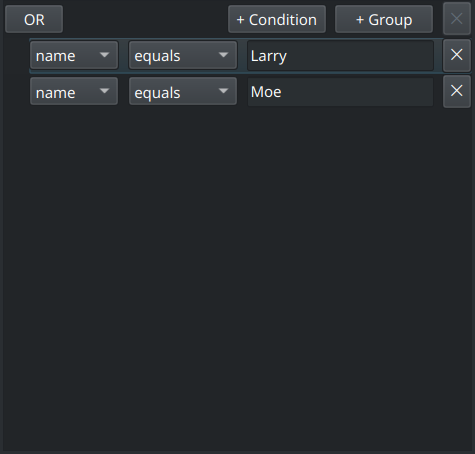
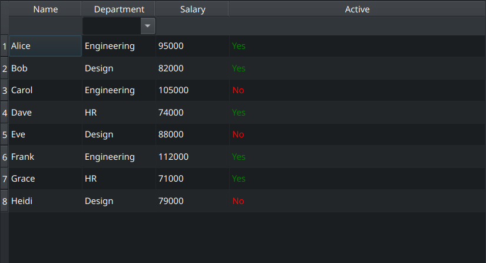

# QtKit

This library solves some common issues I encounter regularly with Qt. All Qt interaction is done through qtpy and is tested with PySide6, other versions should work fine but are not tested.

---

## CustomRoleEnum

Base class for defining custom item data roles that start at `Qt.UserRole + 1`. Use `enum.auto()` — values are assigned correctly without manual offsets.

```python
import enum
from qtkit.CustomRoleEnum import QtCustomRoleEnum

class MyRoles(QtCustomRoleEnum):
    Name  = enum.auto()  # Qt.UserRole + 1
    Age   = enum.auto()  # Qt.UserRole + 2
    Email = enum.auto()  # Qt.UserRole + 3

item.setData("Alice", MyRoles.Name)
item.data(MyRoles.Name)  # "Alice"
```

---

## QueryBuilder



A Qt MVP query builder UI backed by an AST object model. Users construct arbitrarily nested `AND`/`OR` groups of field comparisons. The result is a plain Python object tree that any query backend can consume.

**Fields** are defined ahead of time and passed to the controller:

```python
from qtkit.QueryBuilder import Field

fields = [
    Field(
        name="name",
        type=str,
        operators=["contains", "equals", "starts with"],
        value_model=None,
        allow_custom_values=False,
        default_operator="contains",
    ),
    Field(
        name="status",
        type=str,
        operators=["=", "!="],
        value_model=status_model,   # QAbstractItemModel drives the value combo box
        allow_custom_values=False,
        default_operator="=",
    ),
    Field(
        name="age",
        type=int,
        operators=["=", ">", "<", ">=", "<="],
        value_model=None,
        allow_custom_values=False,
        default_operator=">=",
    ),
]
```

The `type` drives the value editor — `str` → `QLineEdit`, `int` → `QSpinBox`, `float` → `QDoubleSpinBox`, `datetime.date` → `QDateEdit`, `datetime.datetime` → `QDateTimeEdit`, `bool` → combo box. If `value_model` is set it takes precedence; `allow_custom_values` makes the combo editable.

**Controller** is the entry point:

```python
from qtkit.QueryBuilder import QueryBuilderController

ctrl = QueryBuilderController(fields)
layout.addWidget(ctrl.view())

# Read the current query as an AST
result = ctrl.build()  # -> AndOperator | OrOperator | None
```

**AST types:**

```python
from qtkit.QueryBuilder import AndOperator, OrOperator, Comparison

# AndOperator / OrOperator hold a list of children (recursive)
# Comparison holds the Field object, operator string, and value string
```

**Serialization** — round-trip via plain dicts (JSON-safe). Field objects are not serialized; they are resolved by name on load:

```python
from qtkit.QueryBuilder import serialize, deserialize

data = serialize(ctrl.build())
# {"type": "and", "comparisons": [
#     {"type": "comparison", "field": "name", "operator": "contains", "value": "foo"},
#     {"type": "or", "comparisons": [...]}
# ]}

ctrl.load(deserialize(data, fields))
```

**Embedding in a larger view** — pass an existing `QueryBuilderView` to avoid creating a new window:

```python
from qtkit.QueryBuilder import QueryBuilderView, QueryBuilderController

view = QueryBuilderView()
ctrl = QueryBuilderController(fields, view=view)
```

---

## SchemaTable



A generic table model driven by column objects. Each column defines how to extract, display, and edit data — the model contains no column-specific branching.


```python
from qtkit.SchemaTable import SchemaTableModel, AttributeColumn, DictKeyColumn

# Works with dataclass / object rows
columns = [
    AttributeColumn("Name", "name"),
    AttributeColumn("Email", "email", mutable=True),
]
model = SchemaTableModel(columns)
model.setRows(my_objects)

# Works with dict rows
columns = [
    DictKeyColumn("Name", "name"),
    DictKeyColumn("Job", "job"),
]
model = SchemaTableModel[dict](columns)
model.setRows(my_dicts)

view = QTableView()
view.setModel(model)
```

**Custom columns** — subclass `SchemaColumn` and implement `getData` and `header`:

```python
class StatusColumn(SchemaColumn):
    def header(self, role, index):
        if role == Qt.ItemDataRole.DisplayRole:
            return "Status"

    def getData(self, item, role, index):
        if role == Qt.ItemDataRole.DisplayRole:
            return "🟢 Active" if item.active else "🔴 Inactive"
```

Columns can compute values from multiple fields:

```python
class FullNameColumn(SchemaColumn):
    def header(self, role, index):
        if role == Qt.ItemDataRole.DisplayRole:
            return "Full Name"

    def getData(self, item, role, index):
        if role == Qt.ItemDataRole.DisplayRole:
            return f"{item.first_name} {item.last_name}"
```

**Async-safe handles** — columns doing background work (thumbnails, network) can take a handle and validate it before applying results:

```python
handle = self.model().handle(index)
# ... do async work ...
if self.model().isHandleValid(handle):
    self.model().dataChanged.emit(...)
```

**Filter header** — `SchemaHeaderView` expands the header to show a widget below the label for any column that provides one. Use `ComboBoxHeaderMixin` for a built-in combo box backed by a `QStandardItemModel`:

```python
from qtkit.SchemaTable import SchemaTableModel, DictKeyColumn, ComboBoxHeaderMixin, SchemaHeaderView
from qtpy.QtGui import QStandardItem

class StatusColumn(ComboBoxHeaderMixin, DictKeyColumn):
    def __init__(self):
        super().__init__("Status", "status")
        for label in ("All", "Active", "Inactive"):
            self.completionModel().appendRow(QStandardItem(label))

model = SchemaTableModel([StatusColumn(), DictKeyColumn("Name", "name")])
model.setRows(my_dicts)

view = QTableView()
view.setHorizontalHeader(SchemaHeaderView())
view.setModel(model)
```

Connect to the combo box to filter:

```python
col = model.columnAt(0)
col.headerWidget(view.horizontalHeader().viewport()).currentIndexChanged.connect(on_filter_changed)
```

---

## ImageColumn

A `SchemaColumn` that asynchronously loads and caches images from local paths or URLs, backed by a `DataLoader`.

```python
from qtkit.SchemaTable import ImageColumn
from qtkit.DataLoader import LocalFileLoader, RemoteFileLoader

# Local images
loader = LocalFileLoader(num_threads=4, max_queue_size=256)

# Remote images
loader = RemoteFileLoader(num_threads=4, max_queue_size=256)

column = ImageColumn(
    header="Thumbnail",
    path_attribute="image_url",  # attribute name or dict key
    loader=loader,
    thumbnail_size=QSize(128, 128),
    placeholder=placeholder_pixmap,
    error_placeholder=error_pixmap,
    cache_size=256,
)
```

Override `extractPath` to derive the URL from an item in a non-standard way:

```python
class AvatarColumn(ImageColumn):
    def extractPath(self, item):
        return f"https://cdn.example.com/avatars/{item.user_id}.jpg"
```

---

## DataLoader

Deferred file loading with a `QNetworkAccessManager`-style API. Call `load()`, get a `LoadResult` back immediately, connect to `finished`, read data in the slot.

```python
from qtkit.DataLoader import LocalFileLoader, RemoteFileLoader

loader = LocalFileLoader(num_threads=4, max_queue_size=256)
# or
loader = RemoteFileLoader(num_threads=4, max_queue_size=256)

result = loader.load(QUrl.fromLocalFile("/path/to/file.bin"))
result.finished.connect(on_loaded)

def on_loaded(self):
    result = self.sender()  # returns the LoadResult

    if result.isCancelled():
        return  # evicted from queue due to max_queue_size
    if result.error():
        print(f"Failed: {result.error()}")
        return

    data: bytes = result.data()
```

**Bounded queue** — when `max_queue_size` is set, the queue is backed by a deque. Oldest pending requests are evicted (and their results emit `finished` with `isCancelled() == True`) when the queue is full. Useful when users scroll rapidly and stale requests should be discarded.

**Custom HTTP sessions** — `RemoteFileLoader` accepts a session factory. Each worker thread calls it once to create its own `requests.Session`:

```python
def make_session():
    s = requests.Session()
    s.headers["Authorization"] = "Bearer my-token"
    s.mount("https://", HTTPAdapter(max_retries=3))
    return s

loader = RemoteFileLoader(session_factory=make_session)
```

---

## FutureWatcher

Bridges `concurrent.futures` with Qt signals. Emits `finished(Future)` on the main thread when a submitted task completes.

```python
from qtkit.Futures import FutureWatcher

executor = ThreadPoolExecutor()

watcher = FutureWatcher.submit(executor, long_running_fn, arg1, arg2)
watcher.finished.connect(on_done)

def on_done(self, future):
    result = future.result()  # raises if the task raised
```

Or wrap an existing future:

```python
future = executor.submit(fn)
watcher = FutureWatcher(future)
watcher.finished.connect(on_done)
```

---

## CopyWorker / CopyController

Chunked file copy with progress reporting and cancellation. `CopyController` manages the worker on a dedicated `QThread` — signals cross the thread boundary automatically via Qt's queued connections.

```python
from qtkit.CopyWorker import CopyController, CopyItem

controller = CopyController()
controller.progressChanged.connect(on_progress)
controller.busyChanged.connect(on_busy)
controller.error.connect(on_error)

controller.copy([
    CopyItem(src_path="/src/a.bin", dst_path="/dst/a.bin", size=os.path.getsize("/src/a.bin")),
])

# Cancel mid-copy
controller.cancel()

# Clean shutdown — stops worker, joins thread
controller.shutdown()
```

Connect `app.aboutToQuit` to `controller.shutdown()` to ensure a clean exit:

```python
app.aboutToQuit.connect(controller.shutdown)
```

`progressChanged` fires at most every 500ms with a `ProgressUpdate(progress, total, time_remaining)`.
